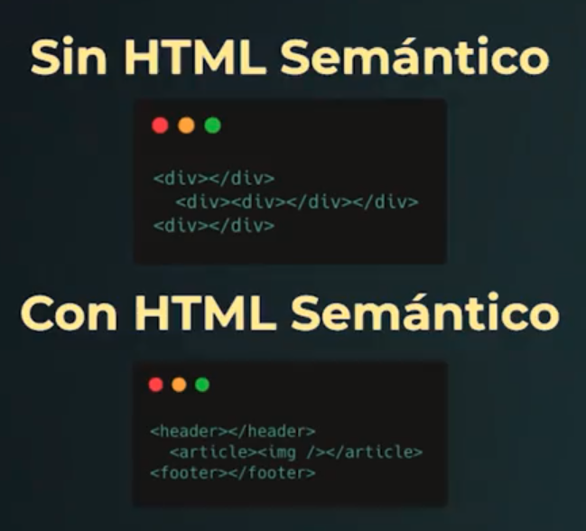

# ACCESIBILIDAD

## Accesibilidad web

Practica continua de asegurarnos que todo lo que creamos para la web se puede usar, interpretar y operar por una variedad de personas en una variedad de situaciones.

a11y - numerónimo de accesibilidad

## Por que?

- Para incluir a personas con discapacidad: (20% del mundo) La mayoria de las personas que creamos la web estamos somos privilegiadas
- Para mejorar la usabilidad de nuestros proyectos: La vibracion del movil fue creado para personas con discapacidad, y es muy util. El modo escuro tambien es accesibilidad.
- Por que en algunos lugares es ley: En USA es ley la accesibilidad.

## Que es WCAG?

Web Content Accesibility Guidelines - Pautas de accesibilidad para el Contenido Web

Es un rango de recomendaciones para crear contenido web mas accesible. Creados por la W#C (World Wide Web Consortium). WAI Iniciativa dentro W#C cuya meta es asegurar la accesibilidad web.

## Profundizando los 12 criterios de conformidad

Las pautas de accesibilidad de contenido web nos guían al momento de implementar la accesibilidad web. Las podemos usar durante todo el proceso de desarrollo de producto, desde que nace la idea para lo que queremos construir, durante el diseño de los estilos y las interfaces, hasta cuando escribimos código y hacemos pruebas de calidad. Nos señalan los puntos importantes para tener en cuenta con eso podemos construir páginas, productos y aplicaciones que le funcionan a todos nuestros usuarios sin importar su capacidades, dispositivos o preferencias.

Aunque las pautas (referidas también por su nombre en inglés WCAG) son muy completas y siguen creciendo a medida que nuestras tecnologías crecen, es importante conocer los 4 principios que nos guían para poder tomar decisiones puntuales a nivel de nuestros productos. Dentro de cada principio encontramos los criterios de conformidad que se pueden interpretar acorde al nivel de WCAG que le quieres o debes aplicar a tu sitio web. Recuerda que los 3 niveles son:

A - nivel basico

AA - nivel intermedio

AAA - nivel avanzado al cual debemos apuntar si trabajamos en servicios del gobierno, universidades o servicios esenciales de la vida cotidiana.

### 4 principios de WCAG

En esta lectura vamos a profundizar sobre los criterios de conformidad para tener una idea más clara de que podemos encontrar dentro de WCAG. Podemos empezar por el primer principio:

1. Perceptible

Los criterios de conformidad bajo este principio se enfocan en asegurar que todo el contenido que es importante se pueda interpretar de varias maneras. Aqui nos queremos

1.1 Asegurar que estamos proporcionando alternativas textuales para todo contenido no textual.
1.2 Proporcionar alternativas para los medios tempodependientes (como videos o audios, queremos ofrecer opciones como subtítulos o guiones).

1.3 Crear contenido que se pueda presentar de diferentes formas sin perder información o estructura.

1.4 Facilitar a los usuarios ver y oír el contenido, incluyendo la separación entre el primer plano y el fondo

2. Operable

Cuando hablamos de ser operable, queremos asegurarnos que nuestro sitio es fácil de usar y navegar, que se puede navegar de diferentes maneras y con mouse y/o teclado

2.1 Proporcionar acceso a toda la funcionalidad mediante del teclado

2.2 Darle a las usuarias suficiente tiempo para leer y usar el contenido (tener esto en cuenta cuando hacemos time outs, comunicarlos y dar opciones para pedir más tiempo si es necesario)

2.3 Tener mucho cuidado de no usar elementos que brillan o se mueven muy rápido ya que pueden provocar ataques, espasmos o convulsiones

2.4 Asegurarnos que nuestros usuarios pueden navegar, encontrar contenido y determinar dónde se encuentran en nuestros sitios

3. Comprensible

Hacer que nuestro sitio web sea comprensible nos asegura que un rango de personas lo pueden usar desde la persona que vive con una discapacidad mental que necesita patrones comunes para saber cómo usar la web hasta la persona que va de carrera y necesita consultar algo rápido

3.1 Tener en cuenta los tamaños de texto y contraste de colores para que los textos resulten legibles y comprensibles

3.2 Hacer que las páginas web aparezcan y operen de manera predecible.

3.3 Dar instrucciones para evitar errores y oportunidades para corregirlos cuando ocurren

4. Robusto

Cuando hacemos productos que funcionan en muchos lados, abrimos las posibilidades que cualquier persona los use sin importar su ubicación, máquina, navegador y mucho más

4.1 Maximizar la compatibilidad con las aplicaciones de usuario actuales y futuras, incluyendo las tecnologías asistivas

Así son los criterios de conformidad para la version 2.0 de WCAG. Te invito a entrar a la documentación y leer sobre que es necesario a cada nivel. ¿Hay alguno que te sorprende? ¡Cuéntame en los comentarios!

http://www.sidar.org/traducciones/wcag20/es/

## Tecnologias Asistivas

1. Visuales

   - Lectores de pantalla
   - Extenciones que manioulan CSS

2. Motoras

   - Varilla bucal
   - Switch

## HTML Semantico

Le agrega significado a nuestro contenido.

### ARIA (Accesible Rich Internet Aplications)

Un conjunto de atributos especiales para accesibilidad que pueden anadirse a cualquier etiqueta, pero especialemente adapatado a HTML.

#### Atributos de ARIA

- Roles: Define el tipo general del objeto (como un articulo, una alerta o un deslizador)
- Propiedades: Comunican atributos que son esenciales para el comportamiento o significado de un elemento pero que se suelen comunicar visualmente. (HTML: arial-label)
- Estados: Comunican estados y cambios de estados en elementos que se suelen comunicar visualmente.

### Tabindex

Indica si su elemento puede ser enfocado, y si participa en la navegacion secuncial del teclado.

- Valor negativo (-1): el elemnto debe ser enfocado, pero no debe ser accesible a traves de la navegacion.
- Valor positivo (>0): debe ser enfocado y su orden relativo es definido por el valor del atributo.

<a href="./">link</a>
